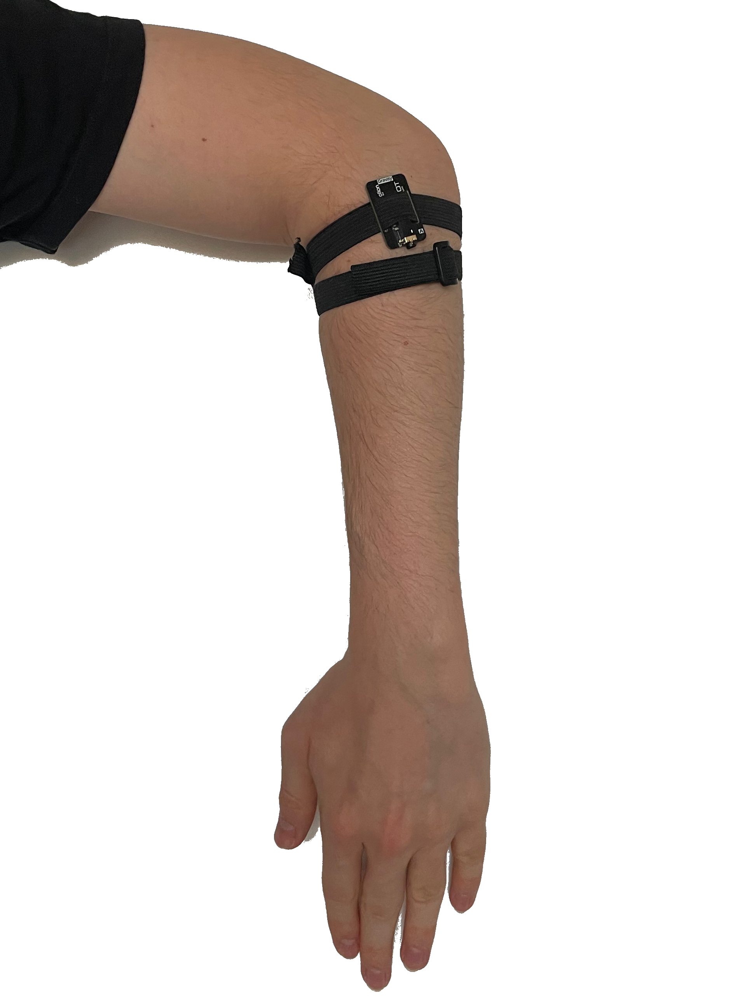
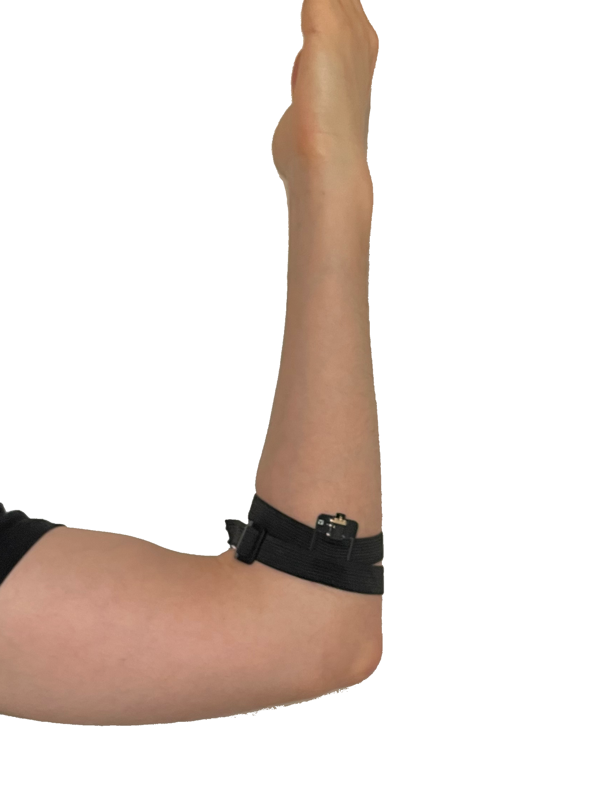

# Signal_classification

# EMG Classification

Code from folder :

```bash
./EMG_classification
```

Is a library intended to classify signal from two SEN0240 sensors. This library detect when the hand is raised and lowered.

## Hardware needed

A [SEN0240](https://www.dfrobot.com/product-1661.html) is needed to get muscle contraction info.
An [Arduino](https://store.arduino.cc/) (or similar) to compute data from SEN0240.

## prerequisite

If you are using a clone of arduino please download firmware to detect device in Arduino firmware.

It should now appear fine in [Arduino IDE](https://www.arduino.cc/en/Main/OldSoftwareReleases) under **tools > port**.
## Connection

All connection needed to make the sensors works can be found [here](https://github.com/Handterpret/SEN0240_Demo/blob/main/README.md).

## Sensors placement

The sensors should be placed like the examples below. To place the sensors precisely you can also try lowering the hand to see which muscle is activated and place the top sensor in the alignment of this muscle. Do the same for the bottom sensor.

Top sensor placement       |  Bottom sensor placement
:-------------------------:|:-------------------------:
     | 

## Calibration

When executing the software a calibration will be done. Follow the instruction on screen. Lower your hand two times the raise it two times when asked. This calibration is done to remove noise from neighbour muscle during the movement.

# Infrared Classification

Code from folder :

```bash
./Infrared_classification
```

Is intended to classify signal from Infrared diodes and leds.

Please refer to : <https://github.com/Handterpret/Infrared_Analysis>

## Training

Training a model is made with file :

```bash
./Infrared_classification/train.py
```
For info on how to use, Please see:

```
python3 ./Infrared_classification/train.py --help
```


Dataset Architecture :
```
Dataset
    - Class1
        - ***.npy
        - ***.npy
        ...

    - Class2
        - ***.npy
        - ***.npy
        ...
    ...
```

## Experience: classify lights on/off

To do this experiment we have 3 steps to follow:

- Create a dataset using our microcontroller
- train a classifier on this dataset
- check in real conditions if classifier is working well

### Dataset creation

To create the dataset we need few things :
- Arduino board (or Movuino)
- serial cable
- wiring describe in <https://github.com/Handterpret/Infrared_Analysis> under test with multiplexing
- TODO install libraries

1. First you'll need to upload [this code](https://github.com/Handterpret/Infrared_Analysis/blob/main/Sketches/data_batch/data_batch.ino) in your microcontroller
1. Then replace YOUR_DATA_FOLDER and run : 

```bash
python3 .\src\GetData.py -o YOUR_DATA_FOLDER
```

This will launch the data getter every second, for this example we just have to take 10 data while lights are off and 10 while lights are on

For this example I turn on the lights at the tenth message and stop the program at the 20th message

After this just go to YOUR_DATA_FOLDER and put datas in subfolder

In my example I create a folder OFF where i put my datas from 0 to 10 and a folder ON where i put my datas from 11 to 20

### training classifier

To train the classifier just do :

```bash
python3 infrared_classification\train.py --data_path YOUR_DATA_FOLDER -o MODEL_OUTPUT_FOLDER
```

This will train a simple model and save it under MODEL_OUTPUT_FOLDER

### testing our model

Testing of the model is in <https://github.com/Handterpret/Infrared_Analysis> just do 

```
python3 .\src\Infer.py --model_path MODEL_OUTPUT_FOLDER
```

This will take the model and read the serial port to classify in live

## Bonus: convert model to TinyML to run live on arduino

Just run
```
python3 infrared_classification\TinyMLConverter.py --model_path MODEL_OUTPUT_FOLDER -o MODEL_TINY_OUTPUT_FOLDER
```

This section is a WIP (if interessed in it follow [this tutorial](https://blog.arduino.cc/2019/10/15/get-started-with-machine-learning-on-arduino/))
